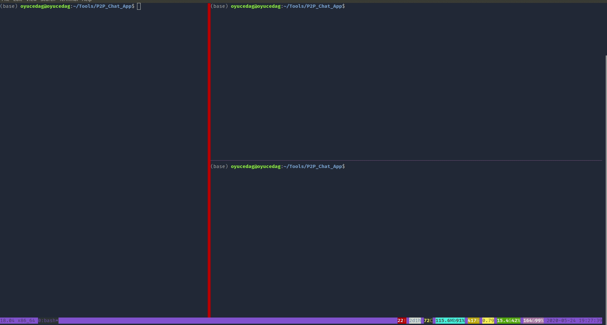

# CSE 4057 Programming Assignment Report

> **Merve Yıldırım - 150114049**				

> **Onur Can Yücedağ - 150116825**

- [CSE 4057 Programming Assignment Report](#cse-4057-programming-assignment-report)
  - [Flow Diagram](#flow-diagram)
  - [Application of Security Features](#application-of-security-features)
    - [Public Key Certification:](#public-key-certification)
    - [Handshaking:](#handshaking)
    - [Key Generation:](#key-generation)
    - [Message Encryption:](#message-encryption)
    - [Integrity Check:](#integrity-check)
  - [Development Process](#development-process)
  - [Running the Code](#running-the-code)
    - [Prerequisites](#prerequisites)
    - [Execuiton Order](#execuiton-order)
    - [Execution](#execution)
  - [Demo](#demo)

*The project is an encrypted peer-to-peer messaging platform written in Python. The project uses the `pycryptodome` library for encryption needs and `select` library for concurency.*

## Flow Diagram

## Application of Security Features

### Public Key Certification: 

A private and public key was created by RSA for each user. Clients sent their public keys to the server along with their username to introduce themselves to the server. The server signed this key and created a certificate, stored the certificate, and also sent a copy to the Clients. The clients received the certificate and verified that the certificate was correct and that the public key was received correctly by the server.

### Handshaking:
Client1 sent a “hello” message to Client2 along with the public key certificate and public key. Client2 sent back a random number (nonce) with its public key certificate and public key. Client1 encrypted nonce with its private key and sent it back to Client2. Client2 decrypted nonce with Client1's public key and verified nonce and sent "ack = okay" to user1. Then Client1 created a master secret from the AES Key and initialization vector. Along with the Client2 public key, it encrypted this master secret with RSA and sent it to Client2. Client2 decrypted this master secret with its private key and confirmed that they are the same.

### Key Generation: 

In the case where ack is okay, the master secret is created. The first 16 bytes of master secret yield Aes Key, while the last 16 bytes give the initialize vector.

### Message Encryption:

Encryption in messages was made using AES.MODE_CBC. Pad and unpad operations were performed for the size of the messages.

### Integrity Check:  

The message entered by Client1 was processed and then hashed with HMAC with AES Key. AES Key, initialize vector and message are encrypted with AES. Hashed and encrypted messages were combined and sent to Client2. Client2 received a hash message and encrypted message. The word "marmara" was put between them so they can be splitted correctly.. First, the encrypted message was decrypt with the AES key and initialized vector. The following message hashed with the AES key and the hashed message has been confirmed. Message integrity is provided.

## Development Process

We fixed the communication problem caused by the pandemic with zoom meetings and phone calls. We used the Visual Studio Code Live Share plugin throughout the project. In this way, we were able to develop the code together. First of all, we started by studying the subject. After addressing our shortcomings, we talked about how to apply it to the project. We completed the code by explaining the places that we don't understand.

## Running the Code

### Prerequisites
- For executing the codes, a system needs to have:
  - Python 3.6+
  - pycryptodome==3.9.0

### Execuiton Order
- Order of execution is as follows:
  - p2p_server.py
  - p2p_client2.py
  - p2p_client1.py

### Execution
- Running the code:
  - `python p2p_server.py`
  - `python p2p_client2.py`
  - `python p2p_client1.py`
- You can find out more information from **`Demo`** section below.

## Demo

